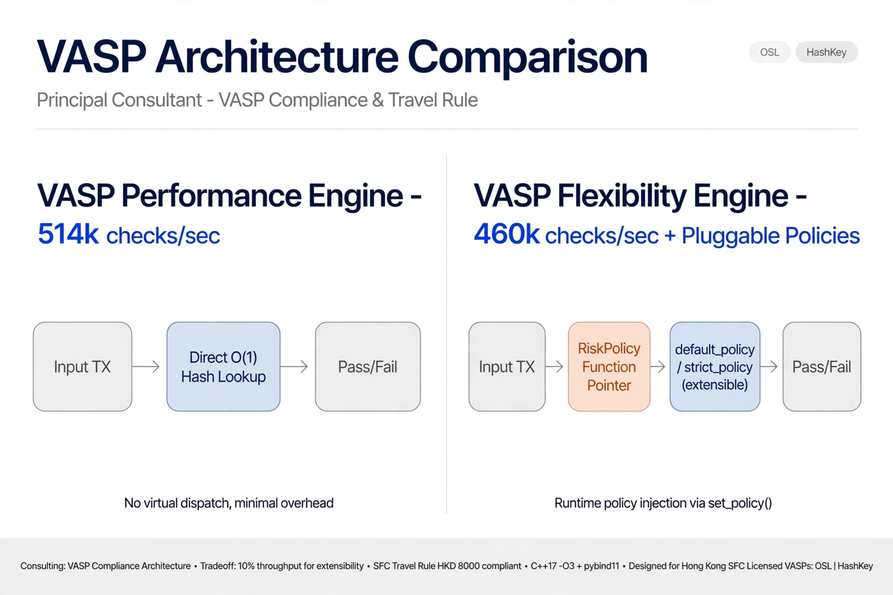

# VASP Flexibility Engine - 460k checks/sec + Pluggable Policies

Pluggable compliance architecture for Hong Kong SFC Travel Rule.

## Architecture Tradeoff

This repo demonstrates **Flexibility**: Runtime policy injection via `set_policy()`

| Engine | Throughput | Key Feature |
|--------|------------|-------------|
| Performance | 514k checks/sec | Direct O(1) hash lookup |
| **Flexibility (this repo)** | **460k checks/sec** | **RiskPolicy function pointer** |

**Cost of flexibility:** ~10% throughput for extensibility - enables `default_policy` / `strict_policy` / custom policies without recompiling.

- Build: C++17 -O3 + pybind11
- Compliance: SFC Travel Rule HKD 8000
- Designed for: Hong Kong SFC Licensed VASPs: OSL | HashKey
- Consulting: Principal Consultant - VASP Compliance & Travel Rule

Counterpart: https://github.com/nsmanju/vasp-performance-engine
